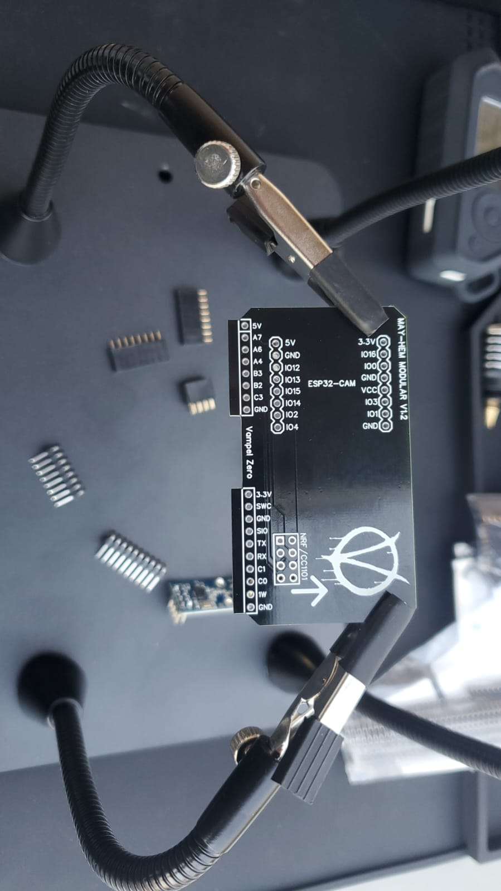

# Flipper Zero Custom Board

Fliper Zero board diseñada basandome en las boards que hay en linea con la diferencia que esta no es necesario girarla.
Esta basada en MAYHEM y se usan los firmware de Mayhem.

#
agradecimientos especiales a los desarrolladores de los Firmware e inspiracion para llevar a cabo este proyecto:
- [Justcallmekoko](https://github.com/justcallmekoko/ESP32Marauder)
- [Eried](https://github.com/eried/flipperzero-mayhem)
- Cyber-bros

# 

