# Flipper Zero Custom Board v1.2

Fliper Zero board diseñada basandome en las boards que hay en linea con la diferencia que esta no es necesario girarla y puedes intercambiar de modulos (incluido el ESP32-CAM) suponiendo que en un modulo tiene el Firmware MAYHEM y en otro el DARK PORTAL.

Esta basada en MAYHEM y se usan los firmware de MAYHEM y EVIL PORTAL(en otro ESP32-CAM).

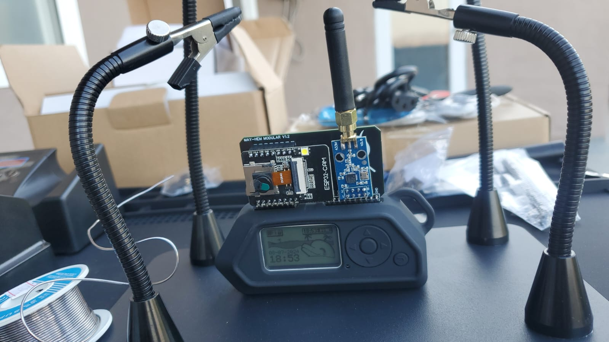
#
Por que Modular?
- en vez de cargar con tantas tarjetas(boards) de diferentes tamaños en tu bolsa, solo lleva los modulos.
- con los conectores hembra de 1x8p ya no es necesario soldar el ESP32-CAM.
- con los conectores hembra de 2x4p ya no es necasario soldar el nrf24l01 / CC1101.

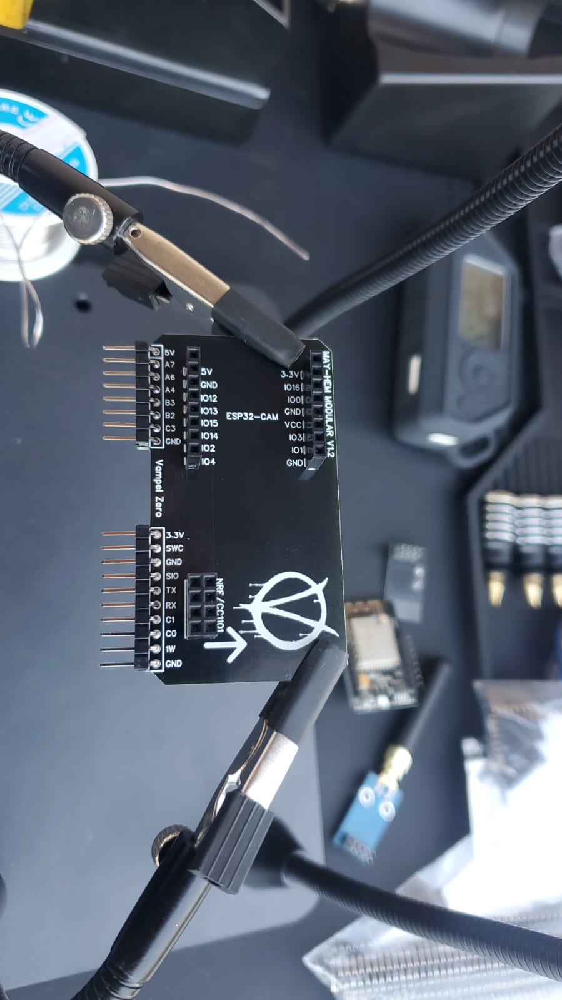

pd. se desoldo el GPIO y se invirtio
#
Cambiando modulos de nrf24l01 / CC1101

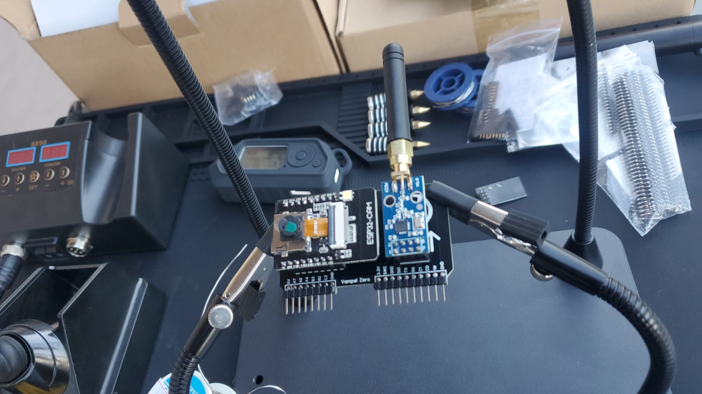
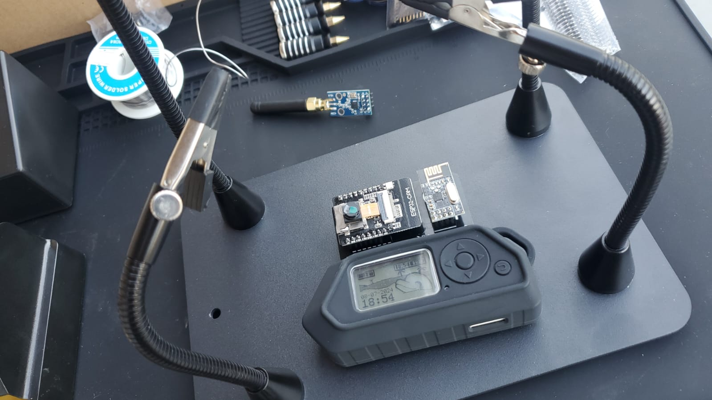

Ambos funcionan y van al 3.3v.
#
El ESP32-CAM queda separado de la placa y tiene mejor acceso al boton de "reset".

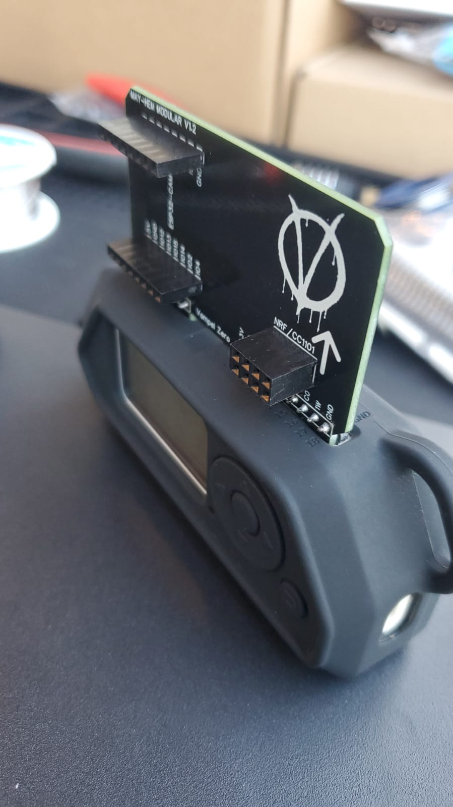

El ESP32-CAM va conectado al 5v (El Flipper no tiene tanta capacidad para levantar varios modulos en un solo conector).
#
Estos fueron los Materiales usados:

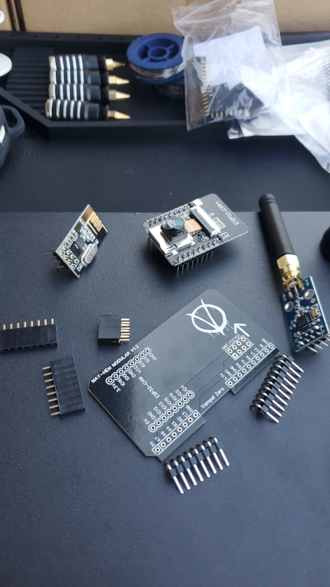

#
Cargando firmware al ESP32-CAM:

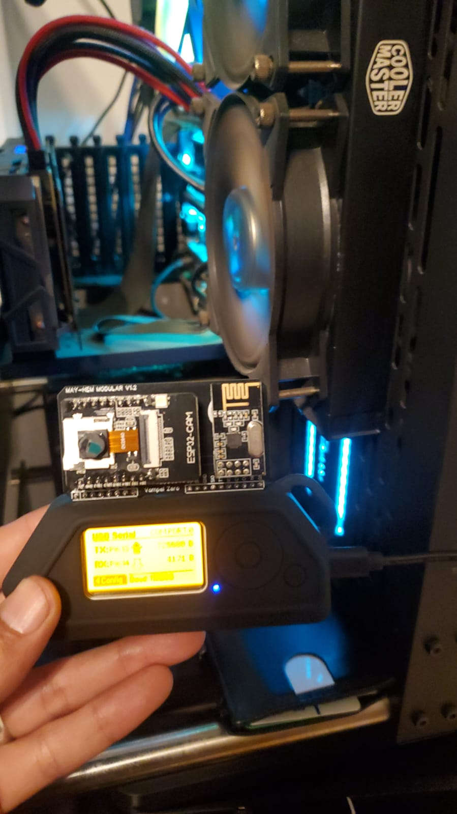

- los firmware los encuentras en los links de abajo (agradecimientos).
#
el diseño:

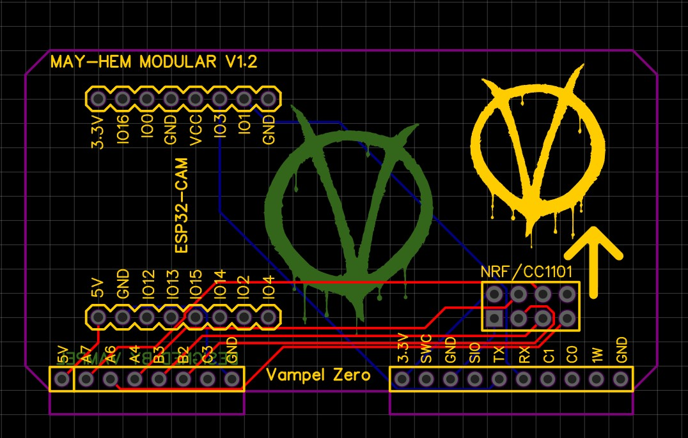
#
asi se ve en 3D:

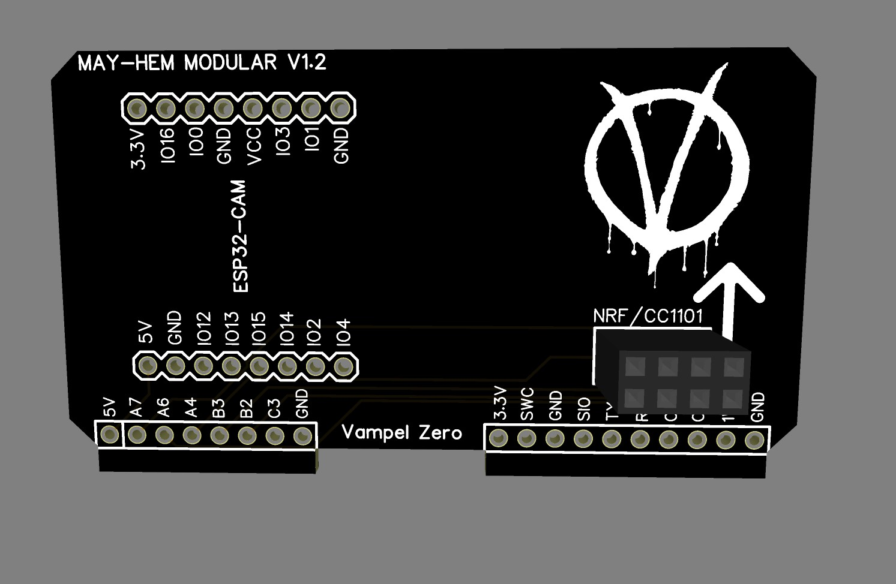

#
3D por atras:

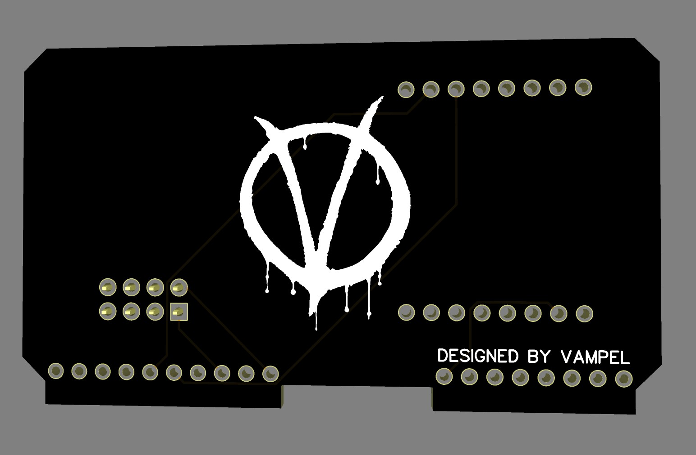

#
agradecimientos especiales a los desarrolladores de los Firmware e inspiracion para llevar a cabo este proyecto( a los que olvide mencionar):
- [Justcallmekoko](https://github.com/justcallmekoko/ESP32Marauder)
- [Eried](https://github.com/eried/flipperzero-mayhem)
- Cyber-bros

# 
- en la version 1.3 (trabajando en eso) si lleva ambos modulos al mismo tiempo e igual son modulares, no se girara como el MAYHEM clasico, por como se menciona el Flipper Zero no tiene tanto poder en sus pines para levantar los 2 juntos asi que llevara un selector(switch)
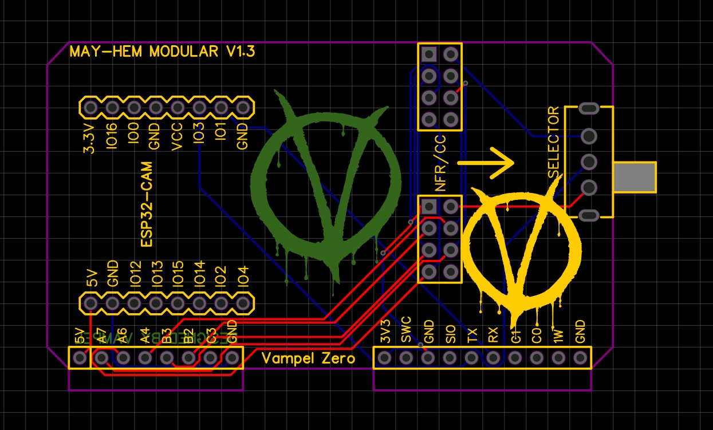
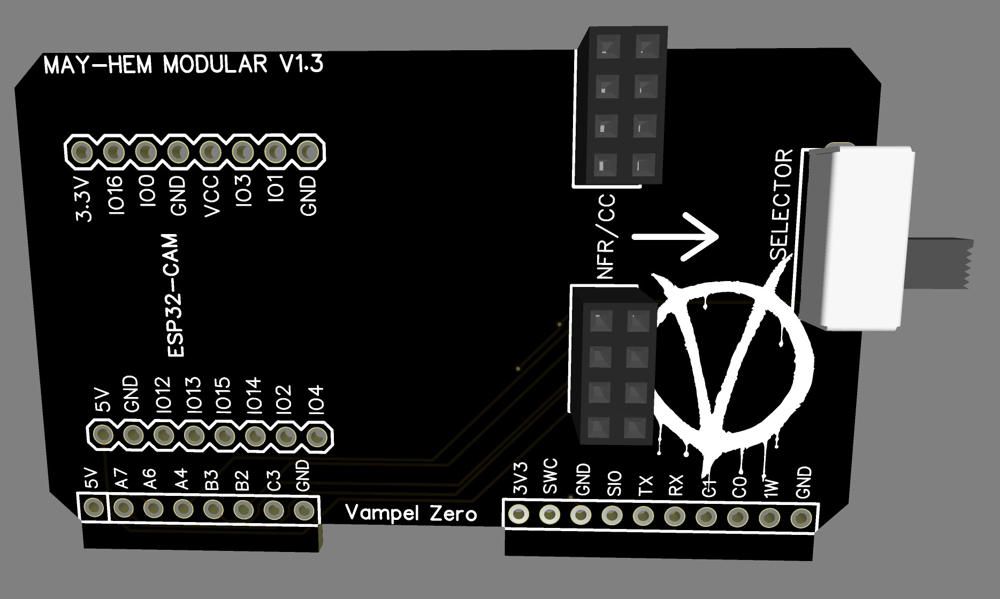

#
por que MAY-HEM y no MAYHEM?

- HEM = Hecho en Mexico.

