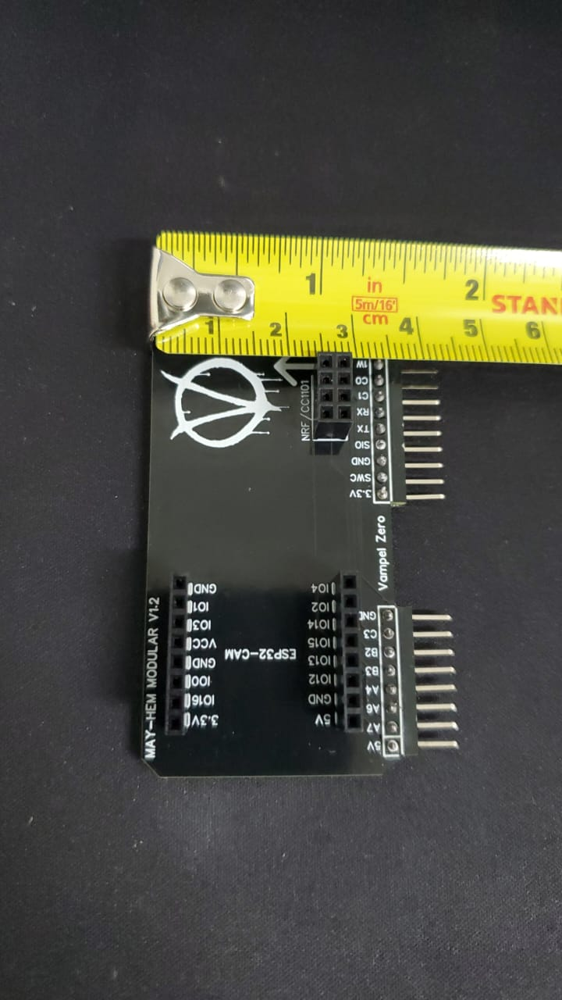

# Flipper Zero Custom Board v1.2

Fliper Zero board diseñada basandome en las boards que hay en linea con la diferencia que esta no es necesario girarla y puedes intercambiar de modulos (incluido el ESP32-CAM) suponiendo que en un modulo tiene el Firmware MAYHEM y en otro el DARK PORTAL.

Esta basada en MAYHEM y se usan los firmware de MAYHEM y EVIL PORTAL(en otro ESP32-CAM).

**Nota Importante: solo existen 10 y logico, yo me quedare con una.. asi que solo hay 9 disponibles y no creo pedir mas...**

#
Por que Modular?
- En vez de cargar con tantas tarjetas(boards) de diferentes tamaños en tu bolsa, solo lleva los modulos.
- Con los conectores hembra de 1x8p ya no es necesario soldar el ESP32-CAM.
- Con los conectores hembra de 2x4p ya no es necasario soldar el nrf24l01 / CC1101.
- Compacta (6.6cm x 4.3cm)

pd. se desoldo el GPIO y se invirtio

.

.
#
Cambiando modulos de nrf24l01 / CC1101

Ambos funcionan y van al 3.3v.
#
El ESP32-CAM queda separado de la placa y tiene mejor acceso al boton de "reset".

El ESP32-CAM va conectado al 5v (El Flipper no tiene tanta capacidad para levantar varios modulos en un solo conector).
#
Estos fueron los Materiales usados:

UPDATE! Para evitar el capacitor que recomiendan en todos los tutoriales de arduino/raspberry sobre el NRF/CC1101 se le agrego un capacitor SMD (805 10v 10uf) que ira entre los conectores 3.3v y GND directo en la board asi no abra perdida de voltaje al entrar en accion la antena del NRF24 (al CC1101 no le afecta por que solo es un capacitor para evitar perdida de energia)

Asi evitamos lo siguiente:

#
Cargando firmware al ESP32-CAM:

Esta es la version que mas me gusto, ambos sin antena, se supone que el flipper zero es portatil.. por eso su diseño compacto(6.6cm x 4.3cm) en comparacion con los que les meten hasta pantalla y antena de 30cm..

- Los firmware los encuentras en los links de abajo (agradecimientos).

- Los Firmware los puedes cargar por UART (con esta board)

- nrf24l01 Recomendacion seguir el manual del capacitor de 10uf
#
el diseño:

#
asi se ve en 3D:

#
3D por atras:

#
agradecimientos especiales a los desarrolladores de los Firmware e inspiracion para llevar a cabo este proyecto( a los que olvide mencionar):
- [Justcallmekoko](https://github.com/justcallmekoko/ESP32Marauder)
- [Eried](https://github.com/eried/flipperzero-mayhem)
- Cyber-bros

# 
- en la version 1.3 (trabajando en eso) si lleva ambos modulos al mismo tiempo e igual son modulares, no se girara como el MAYHEM clasico, por como se menciona el Flipper Zero no tiene tanto poder en sus pines para levantar los 2 juntos asi que llevara un selector(switch)

#
por que MAY-HEM y no MAYHEM?

- HEM = Hecho en Mexico.

